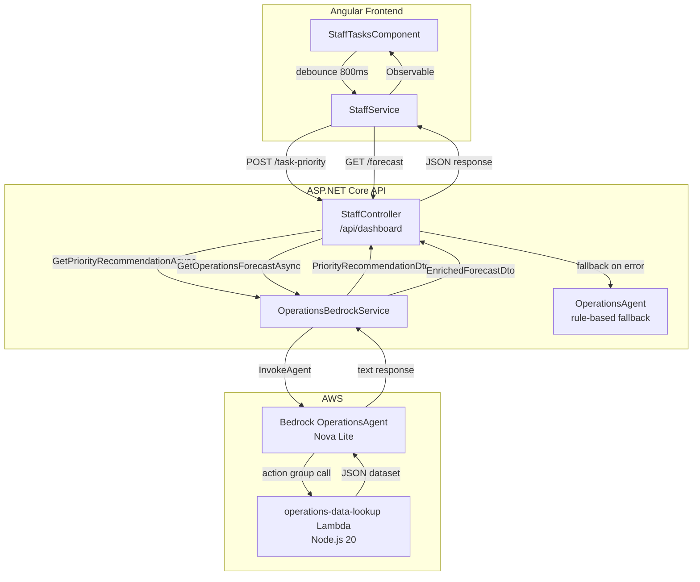

# Design Document: Operations Intelligence Agent

## Overview

The Operations Intelligence Agent adds two AI-driven capabilities to the staff dashboard:

1. **AI Task Priority Assignment** — A debounced call from the task creation form sends the typed description to a new `POST /api/dashboard/task-priority` endpoint. The backend delegates to a new `OperationsBedrockService` which invokes the dedicated OperationsAgent (Bedrock). The agent returns a recommended `TaskPriority` (Low / Medium / High / Critical) and a brief reason. The UI shows the suggestion inline; the staff member confirms or overrides before submitting.

2. **Staff and Inventory Prediction Panel** — On dashboard load, `GET /api/dashboard/forecast` is called. The backend now delegates to `OperationsBedrockService`, which prompts the OperationsAgent to invoke the `operations-data-lookup` Lambda action group and ground its predictions in embedded historical data. The response is an enriched `ForecastDto` with per-department staffing counts, inventory restock items, and an operational outlook string. The frontend renders a new prediction panel above the stats grid.

The design follows the patterns already established in the project:
- `BedrockAgentService` is the template for `OperationsBedrockService` (singleton, reads `appsettings.json`, session-scoped calls, credential fallback).
- `StaffController` and `StaffService` are extended with new endpoints and methods.
- The Angular component uses RxJS debounce for the typing-to-API call flow, consistent with reactive patterns used in the guest chat component.

---

## Architecture



---

## Components and Interfaces

### New: `OperationsBedrockService` (C#)

Located at `HospitalityAI.Api/Services/OperationsBedrockService.cs`.

```csharp
public class OperationsBedrockService
{
    // Constructor reads OperationsBedrock:* keys from IConfiguration
    // Follows same credential fallback as BedrockAgentService

    public Task<PriorityRecommendationDto> GetPriorityRecommendationAsync(
        string description, CancellationToken ct = default);

    public Task<ForecastDto> GetOperationsForecastAsync(
        CancellationToken ct = default);

    // Session ID helpers — deterministic, date-scoped
    // ops-priority-{yyyyMMdd}
    // ops-forecast-{yyyyMMdd}
}
```

Configuration keys (add to `appsettings.json`):
```json
"OperationsBedrock": {
  "Region": "us-east-1",
  "AgentArn": "arn:aws:bedrock:us-east-1:<account>:agent/<agentId>",
  "AgentAliasId": "TSTALIASID",
  "AccessKey": "",
  "SecretKey": ""
}
```

### New: `PriorityRecommendationDto` (C#)

Located at `HospitalityAI.Domain/Dtos/PriorityRecommendationDto.cs`.

```csharp
public class PriorityRecommendationDto
{
    public string Priority { get; set; } = "Medium";  // Low | Medium | High | Critical
    public string Reason { get; set; } = string.Empty;
}
```

### Modified: `ForecastDto` (C#)

Three new fields added to the existing `HospitalityAI.Domain/Dtos/ForecastDto.cs`:

```csharp
public int RecommendedMaintenanceStaff { get; set; }
public int RecommendedFoodBeverageStaff { get; set; }
public string OperationalOutlook { get; set; } = string.Empty;
```

### Modified: `StaffController` (C#)

Two changes:
1. New endpoint `POST /api/dashboard/task-priority`.
2. `CreateTaskRequest` gains an optional `Priority` field.
3. `GET /api/dashboard/forecast` updated to call `OperationsBedrockService` first, with fallback.

New request model:
```csharp
public class TaskPriorityRequest
{
    [Required]
    public string Description { get; set; } = string.Empty;
}
```

### New: `operations-data-lookup` Lambda (Node.js 20)

The Lambda is invoked by the Bedrock agent as an action group. It returns a hardcoded JSON dataset — no external I/O.

Response structure:
```json
{
  "occupancyByDayOfWeek": { "Monday": 62, "Tuesday": 58, ... },
  "taskVolumeByTypeAndDay": {
    "Housekeeping": { "Monday": 24, ... },
    "Maintenance": { "Monday": 6, ... },
    ...
  },
  "inventoryConsumptionRatePerRoom": {
    "bathTowelLinenSets": 2.1,
    "toiletryKits": 1.0,
    ...
  },
  "currentInventoryLevels": {
    "bathTowelLinenSets": 180,
    "toiletryKits": 120,
    ...
  },
  "seasonalAdjustments": {
    "Summer": 1.25,
    "December": 1.35,
    "Default": 1.0
  }
}
```

### Modified: `StaffService` (Angular)

New method:
```typescript
getPriorityRecommendation(description: string): Observable<PriorityRecommendation>
// POST /api/dashboard/task-priority

getForecast(): Observable<EnrichedForecastSummary>
// already exists; return type widened
```

### New/Modified: `app.models.ts` (Angular)

New interface:
```typescript
export interface PriorityRecommendation {
  priority: 'Low' | 'Medium' | 'High' | 'Critical';
  reason: string;
}
```

Modified interface (replaces / extends `ForecastSummary`):
```typescript
export interface EnrichedForecastSummary extends ForecastSummary {
  recommendedMaintenanceStaff: number;
  recommendedFoodBeverageStaff: number;
  operationalOutlook: string;
  inventoryRecommendations?: InventoryItem[];
}

export interface InventoryItem {
  item: string;
  recommendedUnits: number;
  reason: string;
}
```

### Modified: `StaffTasksComponent` (Angular)

Key reactive additions:
- `descriptionInput$ = new Subject<string>()` driven by `(ngModelChange)` on the description field.
- Pipe: `descriptionInput$.pipe(debounceTime(800), filter(v => v.length >= 10), switchMap(...))` feeds `getPriorityRecommendation()`.
- New component state: `prioritySuggestion: PriorityRecommendation | null`, `isSuggestionLoading: boolean`.
- New component state: `forecast: EnrichedForecastSummary | null`, `isForecastLoading: boolean`.

---

## Data Models

### Priority Parsing Logic

The `OperationsBedrockService` parses the Bedrock agent's free-text response to extract a `TaskPriority`. The parse function scans the response string case-insensitively for the tokens `"critical"`, `"high"`, `"medium"`, `"low"` (in that precedence order) and returns the first match. If no token is found, it returns `Medium`.

```csharp
internal static string ParsePriority(string agentResponse)
{
    if (agentResponse.Contains("critical", StringComparison.OrdinalIgnoreCase)) return "Critical";
    if (agentResponse.Contains("high",     StringComparison.OrdinalIgnoreCase)) return "High";
    if (agentResponse.Contains("medium",   StringComparison.OrdinalIgnoreCase)) return "Medium";
    if (agentResponse.Contains("low",      StringComparison.OrdinalIgnoreCase)) return "Low";
    return "Medium"; // default
}
```

### Session ID Construction

```csharp
internal static string BuildSessionId(string prefix, DateTimeOffset now)
    => $"{prefix}-{now:yyyyMMdd}";
// e.g. "ops-priority-20250101", "ops-forecast-20250101"
```

### Historical Data Dataset (embedded in Lambda)

| Field | Type | Example |
|---|---|---|
| `occupancyByDayOfWeek` | `{ [day: string]: number }` | `{ "Monday": 62, "Friday": 85 }` |
| `taskVolumeByTypeAndDay` | `{ [type: string]: { [day: string]: number } }` | `{ "Housekeeping": { "Monday": 24 } }` |
| `inventoryConsumptionRatePerRoom` | `{ [item: string]: number }` | `{ "bathTowelLinenSets": 2.1 }` |
| `currentInventoryLevels` | `{ [item: string]: number }` | `{ "bathTowelLinenSets": 180 }` |
| `seasonalAdjustments` | `{ [season: string]: number }` | `{ "Summer": 1.25 }` |

---

## Correctness Properties

*A property is a characteristic or behavior that should hold true across all valid executions of a system — essentially, a formal statement about what the system should do. Properties serve as the bridge between human-readable specifications and machine-verifiable correctness guarantees.*

### Property 1: Priority Parser Always Returns a Valid TaskPriority

*For any* string that the Bedrock agent might return (including empty strings, strings with no recognizable token, and strings with multiple tokens), `ParsePriority(s)` shall return exactly one of the four valid values: `"Low"`, `"Medium"`, `"High"`, `"Critical"` — never null, never an exception, never any other string.

**Validates: Requirements 1.3**

### Property 2: Priority Parser Defaults to Medium on Unrecognized Input

*For any* string that does not contain the substrings `"low"`, `"medium"`, `"high"`, or `"critical"` (case-insensitive), `ParsePriority(s)` shall return `"Medium"`.

**Validates: Requirements 1.3**

### Property 3: Empty and Whitespace Descriptions Are Rejected

*For any* string composed entirely of whitespace characters (including the empty string), submitting it as a task `description` to `POST /api/dashboard/task-priority` or `POST /api/dashboard/tasks` shall result in an HTTP 400 response — the description shall never result in a task being created or a priority recommendation being requested.

**Validates: Requirements 1.4**

### Property 4: Session ID Format Is Always Well-Formed

*For any* valid `DateTimeOffset`, the session IDs produced by `OperationsBedrockService` shall match the patterns `ops-priority-{yyyyMMdd}` and `ops-forecast-{yyyyMMdd}` respectively, where `{yyyyMMdd}` is the UTC date formatted as an 8-digit string.

**Validates: Requirements 3.4**

### Property 5: Valid Priority Values Are Preserved Through Task Creation

*For any* valid `TaskPriority` value (Low, Medium, High, Critical) provided in the `priority` field of a `CreateTaskRequest`, the resulting persisted task shall have that exact priority value.

**Validates: Requirements 7.2**

### Property 6: Unrecognized Priority Values Fall Back to Medium

*For any* string value in the `priority` field of a `CreateTaskRequest` that is not a recognized `TaskPriority` name (case-insensitive), including null or empty, the resulting persisted task shall have `TaskPriority.Medium`.

**Validates: Requirements 7.3**

### Property 7: Priority Recommendation Is Rendered Completely

*For any* `PriorityRecommendation` object with any valid `priority` string and any non-empty `reason` string, after the StaffTasksComponent receives the recommendation, the rendered DOM shall contain both the `priority` text and the `reason` text somewhere within the suggestion area element.

**Validates: Requirements 5.2**

### Property 8: Forecast Panel Renders All Four Departments

*For any* `EnrichedForecastSummary` with any non-negative integer values for the four staffing fields, the rendered prediction panel shall contain each of the four department labels: `"Housekeeping"`, `"Front Desk"`, `"Maintenance"`, and `"Food & Beverage"`, alongside their respective numeric values.

**Validates: Requirements 6.2**

### Property 9: All Inventory Items Appear in the Forecast Panel

*For any* list of `InventoryItem` objects (including edge cases: empty list, single item, large list), the rendered prediction panel shall display each item's `item` name exactly once — no items are dropped and no extra items are added.

**Validates: Requirements 6.3**

---

## Error Handling

### Backend

| Scenario | Behavior |
|---|---|
| `POST /api/dashboard/task-priority` — empty description | Return HTTP 400 with `{ "message": "Description is required." }` |
| `POST /api/dashboard/task-priority` — Bedrock exception | Return HTTP 500, log exception with structured logging |
| `GET /api/dashboard/forecast` — Bedrock exception | Fall back to rule-based `OperationsAgent.GenerateForecastAsync`, log exception, return 200 with fallback data |
| `OperationsBedrockService` — missing `AgentArn` config | Throw `InvalidOperationException` at startup (fail fast) |
| `ParsePriority` — no token found | Default to `"Medium"` silently |

### Frontend

| Scenario | Behavior |
|---|---|
| `getPriorityRecommendation()` — HTTP error | Hide suggestion area; allow form submission without a priority override |
| `getForecast()` — HTTP error | Hide prediction panel; dashboard statistics grid and task table still render |
| Typing debounce — description goes below 10 chars | Cancel pending recommendation request via `switchMap`; hide suggestion area |
| Form submitted before recommendation returns | Submit without priority field; server applies default (Medium) |

---

## Testing Strategy

### Dual Testing Approach

Both unit/property tests and integration tests are used for comprehensive coverage.

**Unit / Property Tests (C#)**  
Library: [FsCheck](https://fscheck.github.io/FsCheck/) (F#/C# property-based testing library).  
Each property test runs a minimum of 100 iterations.  
Test tag format: `// Feature: operations-intelligence-agent, Property {N}: {property_text}`

Target classes for unit/property tests:
- `OperationsBedrockService.ParsePriority` (pure static method — ideal for PBT)
- `OperationsBedrockService.BuildSessionId` (pure static method)
- `StaffController` action methods (via `WebApplicationFactory` with mocked services)

**Unit Tests (Angular)**  
Framework: Angular's built-in `TestBed` + Jest (matches project's test setup).  
RxJS marble testing for debounce behavior.  
Angular `ComponentFixture` for DOM rendering assertions.

**Integration Tests**
- Backend: `WebApplicationFactory<Program>` with in-memory data store and mocked `OperationsBedrockService`.
- Lambda: Local invocation of the `operations-data-lookup` Lambda via AWS SAM CLI (`sam local invoke`), verifying JSON structure.

**What is NOT property-tested:**
- AWS Bedrock invocation itself — tested with integration tests using 1–2 representative examples.
- Lambda data structure — static embedded dataset, tested with a single schema validation.
- UI loading states — tested with targeted example-based component tests.
