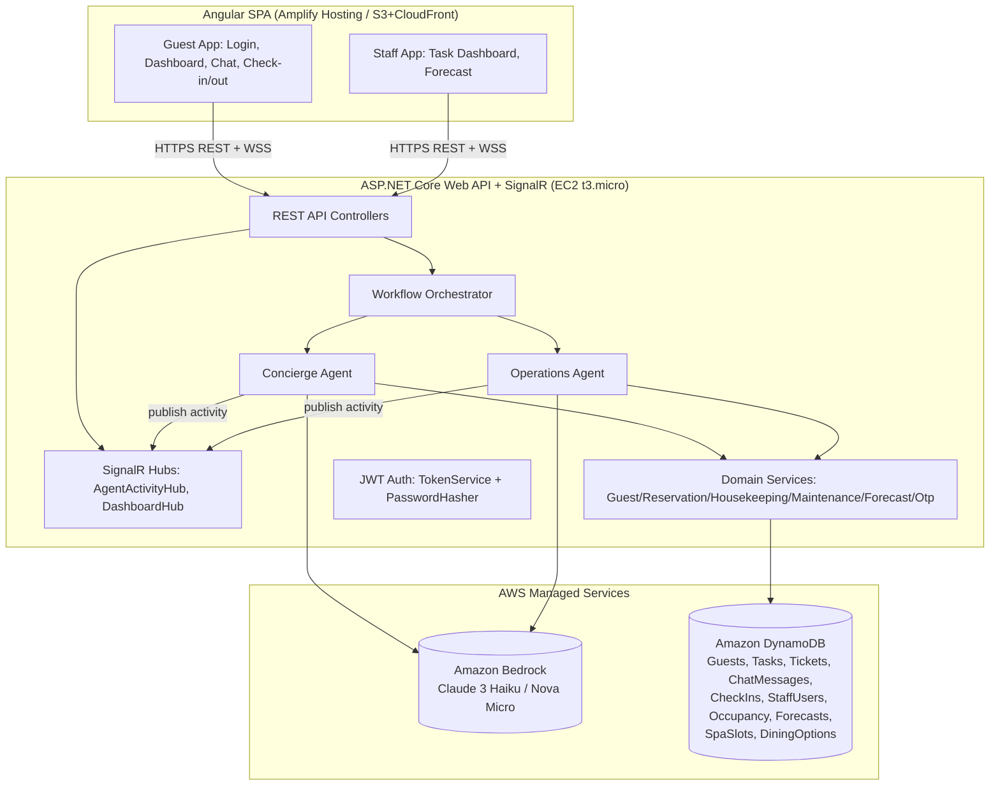

# Hospitality AI Assistant — Kiro Build Specification

> **Purpose of this document**: this is a complete, self-contained functional + technical
> specification of the "Hospitality AI Assistant" application, written so that:
> 1. A **junior developer** with no prior context can read it and understand exactly what the
>    application does and how it is built.
> 2. That developer can hand this document to **Kiro** (AWS's spec-driven-development IDE) and,
>    working through Kiro's spec workflow (`requirements.md` → `design.md` → `tasks.md`), have
>    Kiro generate the entire working application from scratch — using real AWS services, within
>    a strict **$70 total AWS budget**.
>
> Nothing in here should require guessing: data models, algorithms, API contracts, and even the
> exact seed content (FAQ answers, keyword lists) are spelled out in full.

> **Implementation preference**: develop this application using a **flat file structure** rather than
> a deep layered folder hierarchy. Keep the project simple and easy to navigate, with files grouped
> by responsibility at the top level where practical. Any future prompt or implementation instruction
> related to this project should consider this flat-file-structure requirement.

---

## 0. How To Use This Document With Kiro

1. Create a new (empty) repository/workspace and open it in Kiro.
2. Start a new **Spec** in Kiro (Kiro's spec-driven workflow). When Kiro asks what you want to
   build, paste **Section 1 (Product Overview)** plus this sentence:
   > "Use the attached KIRO_BUILD_SPEC.md as the full requirements and design reference. Generate
   > `requirements.md` from Sections 1, 3, 4, 11, 12. Generate `design.md` from Sections 5, 6, 7,
   > 8, 9, 10. Generate `tasks.md` from Section 13, in that exact order."
3. Attach/paste this whole file into the Kiro chat/context so it can reference the exact data
   model, algorithms, seed content, and API contracts instead of inventing its own.
4. Work through Kiro's generated `tasks.md` **top to bottom** — each task is scoped to be small,
   independently testable, and buildable/runnable before moving to the next (this keeps AWS spend
   low because you're never running half-built infrastructure for long).
5. Before enabling any paid AWS resource (Bedrock live calls, EC2, etc.), read **Section 2** and
   set up the AWS Budget alarm first.
6. If Kiro or the junior developer is unsure about any business rule (priority scoring, forecast
   math, FAQ content, etc.), the exact answer is in **Section 7** and **Appendix A** — do not
   improvise; copy it verbatim so behavior matches what was already validated in a working
   prototype.

---

## 1. Product Overview

**Hospitality AI Assistant** is a multi-agent AI system for a hotel that serves two kinds of
users:

- **Guests** — check in/out contactlessly, chat with an AI concierge, and receive personalized
  spa/dining/activity recommendations.
- **Staff** (Manager / Front Desk) — see a live, AI-prioritized task queue (housekeeping,
  room-service, maintenance, guest requests) and an AI-generated daily demand forecast
  (staffing + inventory).

The system is organized around **two domain-owning AI agents**, coordinated by a lightweight
orchestrator:

| Agent | Owns | Capabilities |
|---|---|---|
| **Concierge Agent** | Guest Experience | Multilingual chatbot, FAQ answers, predictive personalization (spa/dining/activity recommendations), contactless check-in (OTP + ID/selfie verification) and checkout |
| **Operations Agent** | Hotel Operations | Real-time staff task prioritization (keyword + AI safety triage), AI-generated demand forecast (staffing + inventory) |
| **Workflow Orchestrator** | Routing | Classifies a free-text guest message as a Concierge-Agent or Operations-Agent concern and routes it |

Both agents call a real **LLM (Amazon Bedrock)** for narrative/reasoning generation, and both
persist data in **Amazon DynamoDB**. A live "agent activity" feed streams each agent's reasoning
steps to the UI in real time (a "Copilot is thinking…" style panel), and staff see live task-queue
updates — both via WebSockets.

### 1.1 Why a real prototype already exists
A working prototype of this exact system was already built and validated (with mocked/offline AI
and in-memory storage, no AWS spend). This document specifies the **same functional behavior**,
now wired to **real AWS services** so the hackathon's "must use AWS" requirement is genuinely met,
while keeping cost tightly controlled for a $70 budget.

---

## 2. AWS Services & Cost Plan ($70 Budget)

**Guiding principle**: use the smallest/cheapest AWS resource that satisfies each requirement, keep
everything inside AWS Free Tier wherever possible, and make it trivial to turn off compute/AI spend
between work sessions.

| Concern | Service | Why / Cost notes |
|---|---|---|
| LLM reasoning (chat, recommendations, forecast narrative, safety triage) | **Amazon Bedrock**, model = **Anthropic Claude 3 Haiku** or **Amazon Nova Micro/Lite** (cheapest capable models) | Pay-per-token, no idle cost. A hackathon demo (a few hundred calls, short prompts) costs low single-digit dollars. Never use Sonnet/Opus-class models except for a final demo polish pass if budget allows. |
| Structured data storage | **Amazon DynamoDB**, on-demand capacity mode | Always-free tier: 25 GB storage + 25 RCU/WCU-equivalent — a hackathon's data volume costs **$0**. |
| Backend compute (ASP.NET Core Web API + SignalR) | **Amazon EC2**, single `t3.micro` (or `t2.micro`) instance | Free Tier: 750 instance-hours/month for 12 months = effectively $0 if the AWS account is Free-Tier eligible. **Stop the instance** (not just close the browser) whenever you're not actively working/demoing. |
| Guest/staff authentication | **Custom JWT auth** (already implemented, see §11.1) — **not** Cognito | Guests log in with just a reservation code (no password) — Cognito would need custom-auth Lambda triggers to support that, adding cost/complexity for no functional benefit at hackathon scale. Custom JWT is $0 and already proven. *(If the hackathon explicitly requires Cognito, add it as a follow-on — see §11.4.)* |
| Frontend hosting (Angular static build) | **AWS Amplify Hosting** (or S3 + CloudFront) | Free tier: 1,000 build minutes/month + 15 GB served/month for 12 months → effectively $0. |
| Secrets (JWT signing key) | Environment variable on the EC2 instance (or `.env`/appsettings, never committed to git) | Skip AWS Secrets Manager (has a small monthly per-secret fee) unless budget allows — not worth it for a single symmetric key in a short hackathon. |
| Monitoring / spend safety net | **AWS Budgets** — set a budget alarm at **$50** (email alert) so you get warned well before the $70 cap | Free to set up. Do this **before** provisioning anything else. |
| SMS OTP for check-in | **Simulated OTP** (already implemented) — code is generated server-side and echoed back in the API response (`demoOtp` field) instead of sent via Amazon SNS SMS | Real SMS via SNS requires an AWS support ticket to lift sandbox limits and has a per-message cost — skip it entirely for the hackathon; the API response already includes the code so the demo UI can show/auto-fill it. |

### 2.1 Estimated total cost for a multi-day hackathon
| Item | Estimate |
|---|---|
| EC2 t3.micro (free tier or ~$0.01/hr if not) | $0–$2 |
| Bedrock (Claude 3 Haiku / Nova Micro, low volume) | $2–$8 |
| DynamoDB (on-demand, low volume) | $0–$1 |
| Amplify Hosting / S3+CloudFront | $0–$1 |
| **Total** | **≈ $5–$15**, comfortably under the $70 cap |

### 2.2 Hard rules to stay under budget
1. Set the AWS Budgets alarm at $50 **first**, before creating any other resource.
2. Keep `Bedrock:ModelId` pointed at a Haiku/Micro-class model. Never switch to Sonnet/Opus/Pro
   models except briefly for a final demo if there is budget headroom.
3. Keep the existing **mock-LLM toggle** (§7.5) so all development/testing of chat flows, UI,
   and business logic happens against the free `MockLlmClient` — only flip to live Bedrock when
   actually testing/demoing the real AI behavior.
4. Stop the EC2 instance whenever not in active use.
5. Use DynamoDB **on-demand** billing mode (not provisioned) so idle tables cost nothing.

---

## 3. User Roles & Personas

| Role | How they authenticate | What they can do |
|---|---|---|
| **Guest** | Reservation code only (no password) | Chat with the Concierge Agent, view personalized recommendations (after check-in), check in (OTP + ID/selfie upload), check out, book a recommended spa/dining slot |
| **Staff — Manager** | Username + password | Everything Front Desk can do, plus (if you choose to gate anything manager-only in future — none is gated today) |
| **Staff — Front Desk** | Username + password | View/prioritize the live task queue, create/complete tasks, view the demand forecast |

Demo seed accounts (see Appendix A for full seed data):
- Guests: reservation codes `RES-8842` (Priya Sharma), `RES-1190` (James Carter), `RES-3327` (Akira Tanaka)
- Staff: `manager` / `Staff@123` (role `Manager`), `frontdesk` / `Staff@123` (role `FrontDesk`)

---

## 4. Functional Requirements (EARS format)

### 4.1 Authentication
- WHEN a guest submits a valid, existing reservation code, THE SYSTEM SHALL issue a signed JWT
  identifying them as role `Guest` with their guest id, room number, and check-in status.
- WHEN a guest submits a reservation code that does not match any guest record, THE SYSTEM SHALL
  return `401 Unauthorized` with a clear error message.
- WHEN a staff member submits a valid username/password, THE SYSTEM SHALL issue a signed JWT
  carrying **two** role claims: the generic `Staff` role (for broad staff-only endpoints) and
  their specific role (`Manager` or `FrontDesk`) for any future fine-grained checks.
- WHEN a staff member submits an invalid username or password, THE SYSTEM SHALL return `401
  Unauthorized` without revealing which of the two was wrong.
- WHEN any authenticated request's JWT is missing, expired, or invalid, THE SYSTEM SHALL return
  `401 Unauthorized`.
- THE SYSTEM SHALL derive the acting user's id from the JWT (`NameIdentifier` claim) for every
  authenticated endpoint — **never** trust a client-supplied guest/user id in the request body
  for actions performed "as yourself" (prevents IDOR).

### 4.2 Concierge Chat (multilingual)
- WHEN a guest sends a chat message, THE SYSTEM SHALL detect the message language (Hindi,
  Japanese, Spanish, French, or default English) using the language-detection rules in §7.4.
- WHEN a guest's message matches one of the FAQ knowledge-base keyword sets (Appendix A.2), THE
  SYSTEM SHALL reply instantly with that FAQ's canned answer, without calling the LLM.
- WHEN a guest's message does not match any FAQ entry, THE SYSTEM SHALL ask the LLM to either (a)
  answer conversationally in place, or (b) reply with the escalation sentinel
  `ESCALATE_TO_FRONTDESK` if the message is a genuine actionable request or a question the LLM
  cannot confidently answer (see the exact system prompt in §7.4).
- WHEN the LLM escalates, THE SYSTEM SHALL (a) create a front-desk ticket carrying the guest's
  name, room number, and exact message, (b) also create a `GuestRequest`-type task on the shared
  Operations task queue (SLA 20 minutes) so front-desk/housekeeping staff see it in the same
  dashboard as other work, and (c) reply to the guest that their request was passed to the front
  desk team.
- WHEN the detected language is not English, THE SYSTEM SHALL prefix the English reply with that
  language's greeting phrase (Appendix A.1) before returning it as `replyInGuestLanguage`.
- THE SYSTEM SHALL persist every guest and assistant chat message.

### 4.3 Predictive Personalization
- WHEN a checked-in guest requests recommendations, THE SYSTEM SHALL build a personalized list
  factoring in: past spa visits, past dining bookings, the current season, and the guest's
  profession/trip purpose — using the exact rules in §7.2.
- THE SYSTEM SHALL stream each reasoning step (as an "agent activity" event) while building
  recommendations, so the UI can show a live "agent is thinking" panel.
- THE SYSTEM SHALL ask the LLM to generate a 2–3 sentence narrative tying the guest's history to
  the chosen recommendations.
- WHEN a guest has no spa or dining history at all, THE SYSTEM SHALL include a generic "explore
  hotel amenities" fallback recommendation.

### 4.4 Contactless Check-in / Check-out
- WHEN a guest starts check-in, THE SYSTEM SHALL require, in order: (1) reservation-code
  confirmation, (2) a one-time passcode (OTP) sent to (simulated: returned in the API response
  for demo purposes) their registered phone and verified by the guest, (3) an ID document image
  and a selfie image upload.
- WHEN all three verification steps succeed, THE SYSTEM SHALL mark the guest checked in, issue a
  "digital key" (a boolean flag in this system — no real IoT lock integration), unlock the
  Recommendations feature for that guest, and immediately generate personalization
  recommendations for them.
- WHEN any verification step fails, THE SYSTEM SHALL record the check-in attempt as `Failed` and
  not check the guest in.
- WHEN a checked-in guest checks out, THE SYSTEM SHALL close their folio (a text summary, no real
  billing system integration), mark them not-checked-in, and re-lock the Recommendations feature.
- THE SYSTEM SHALL ask the LLM to generate a one-sentence natural-language confirmation summary
  for both check-in and checkout.

### 4.5 Staff Task Dashboard (Operations Agent)
- WHEN a new task is created (by staff, or automatically from an escalated guest chat message),
  THE SYSTEM SHALL immediately re-run prioritization over all open tasks.
- THE SYSTEM SHALL prioritize every open task using the exact deterministic scoring rules in
  §7.1, with an AI safety-triage fallback (via Bedrock) for tasks that match no fixed keyword.
- THE SYSTEM SHALL broadcast the freshly re-ranked task list to all connected staff dashboards in
  real time over a WebSocket connection whenever the queue changes.
- WHEN staff mark a task complete, THE SYSTEM SHALL set its status to `Completed`, remove it from
  the open-task view, and re-broadcast the updated queue.
- THE SYSTEM SHALL stream each prioritization reasoning step as a live "agent activity" event.

### 4.6 Demand Forecasting (Operations Agent)
- WHEN staff request a forecast, THE SYSTEM SHALL compute tomorrow's predicted occupancy % and
  room-service order count from the last 14 days of occupancy history using the exact weighted
  moving-average + trend formula in §7.3.
- THE SYSTEM SHALL derive recommended housekeeping staff count, front-desk staff count, and five
  inventory-line recommendations (linens, toiletries, breakfast/room-service supplies, minibar
  restock, cleaning supplies) from that forecast using the exact formulas in §7.3.
- THE SYSTEM SHALL ask the LLM to generate a narrative explanation of the forecast and its
  staffing/inventory implications, and persist the forecast record.
- THE SYSTEM SHALL stream each forecasting reasoning step as a live "agent activity" event.

### 4.7 Live Agent Activity Feed
- WHEN a guest or staff member is signed in and connected to the activity feed, THE SYSTEM SHALL
  stream every reasoning-step message published by whichever agent is acting **on their behalf**
  (identified by their own user id) to their browser only — never another user's activity.

### 4.8 Booking Confirmation
- WHEN a checked-in guest confirms a recommended spa slot or dining option, THE SYSTEM SHALL mark
  that slot/option unavailable (for spa) and return a confirmation with the confirmed time.
  Guest id for this action SHALL be taken from the JWT, never from the request body.

---

## 5. System Architecture



**Deployment topology**: one EC2 instance runs the ASP.NET Core Kestrel process (Web API +
SignalR) behind its security group (HTTPS via a self-signed cert or a free reverse proxy like
Caddy/nginx + Let's Encrypt if you have a domain; HTTP is acceptable for a hackathon demo). The
Angular app is built to static files and hosted on Amplify Hosting/S3+CloudFront, calling the EC2
instance's public URL for the API and WebSocket connections. The EC2 instance's IAM role grants
it permission to call Bedrock (`bedrock:InvokeModel` on the specific model ARN) and to read/write
only the app's own DynamoDB tables — no other AWS permissions.

### 5.1 Layered code architecture (mirrors the validated prototype — keep this structure)
```
UI (Angular) → REST/WebSocket API (Controllers + Hubs)
             → Workflow Orchestrator (routes guest chat intent)
             → { Concierge Agent, Operations Agent }   (business logic, LLM calls, activity publishing)
             → Domain Services (IGuestService, IReservationService, IHousekeepingService,
                                 IMaintenanceService, IForecastService, IOtpService)
             → Data Access (IDataStore interface → DynamoDbDataStore implementation)
```
**Critical rule carried over from the prototype**: agents and controllers depend only on the
domain **service interfaces**, never directly on DynamoDB SDK types. This means swapping the data
store implementation later (e.g. to Aurora) requires touching only the `IDataStore`
implementation — zero changes anywhere else. Apply the exact same principle to the LLM client:
agents depend only on `ILlmClient`, with two implementations — `MockLlmClient` (free, offline,
deterministic) and `BedrockLlmClient` (real AWS) — switchable via a runtime setting, so
development never has to spend Bedrock budget.

---

## 6. Data Model (DynamoDB)

Use **one table per entity** (simpler to reason about for a small hackathon dataset than a
single-table design), **on-demand** billing mode, string `Id` primary keys (GUIDs) unless noted.

| Table | Partition Key | Extra Indexes | Attributes | Notes |
|---|---|---|---|---|
| `Guests` | `Id` (string) | GSI: `ReservationCode` | `FullName`, `PreferredLanguage`, `LoyaltyTier`, `Email`, `Phone`, `RoomNumber`, `ReservationCode`, `IsCheckedIn` (bool), `Profession`, `TripPurpose`, `History` (list of maps: `Type`, `Description`, `Date`, `Rating`) | `History` is embedded — no separate table needed |
| `StaffUsers` | `Id` (string) | GSI: `Username` | `Username`, `PasswordHash`, `PasswordSalt`, `FullName`, `Role` (`Manager`\|`FrontDesk`) | PBKDF2 hash+salt, never store plaintext |
| `StaffTasks` | `Id` (string) | (scan is fine at hackathon scale; optionally GSI on `Status`) | `Type` (`Housekeeping`\|`RoomService`\|`Maintenance`\|`GuestRequest`), `RoomNumber`, `Description`, `Priority` (`Low`\|`Medium`\|`High`\|`Critical`), `Status` (`Pending`\|`InProgress`\|`Completed`), `CreatedAt`, `SlaMinutes` (int), `AssignedTo` (nullable), `PriorityReason` (nullable) | |
| `ConciergeTickets` | `Id` (string) | | `GuestId` (nullable), `GuestName`, `RoomNumber`, `Message`, `Status` (`Open`\|`Resolved`), `CreatedAt` | |
| `ChatMessages` | `Id` (string) | GSI: `ConversationId` | `ConversationId`, `GuestId` (nullable), `Sender` (`Guest`\|`Assistant`), `Language`, `OriginalText`, `TranslatedText` (nullable), `CreatedAt` | |
| `CheckInRequests` | `Id` (string) | GSI: `GuestId` | `GuestId`, `Type` (`CheckIn`\|`CheckOut`), `ReservationCode`, `IdDocumentImageBase64` (truncated to ~64 chars — never store full images, see §11.3), `SelfieImageBase64` (same), `Status` (`Pending`\|`Verified`\|`Failed`), `VerifiedAt` (nullable), `RoomNumber`, `DigitalKeyIssued` (bool), `VerificationSummary` | |
| `OccupancyHistory` | `Date` (string, `yyyy-MM-dd`) | | `OccupancyPercent` (double), `RoomServiceOrders` (int) | One item per day; seeded with 30 days of synthetic history (Appendix A.3) |
| `ForecastRecords` | `Id` (string) | | `ForDate`, `PredictedOccupancyPercent`, `PredictedRoomServiceOrders`, `RecommendedHousekeepingStaff`, `RecommendedFrontDeskStaff`, `RecommendedInventory` (list of maps: `Item`, `RecommendedUnits`, `Reason`), `Notes`, `GeneratedAt` | Write-only in this app (not read back by the UI) |
| `SpaSlots` | `Id` (string) | | `ServiceName`, `StartTime` (datetime), `DurationHours` (int), `IsAvailable` (bool) | |
| `DiningOptions` | `Id` (string) | | `RestaurantName`, `CuisineType`, `AvailableSlot` (datetime), `Description` | |

### 6.1 Static reference/content data — NOT in DynamoDB
The following is **read-only reference content**, not mutable business data, and should ship as a
bundled JSON seed file inside the app (loaded once at startup and cached in memory) rather than as
DynamoDB tables — this avoids DynamoDB reads for data that never changes and costs nothing extra:
- Concierge greetings per language
- Concierge FAQ knowledge base (keywords → answer)
- Seasonal activity recommendations (per season)
- Profession-driven activity recommendations (per profession keyword)
- Maintenance hazard/urgent keyword lists

The exact content to seed is in **Appendix A**. Load it through a small provider/service (mirror
of the pattern in §5.1) so it is still *not hardcoded inside business-logic classes* — it's
just sourced from a bundled file instead of a database table, which is the right trade-off for
truly static reference content.

---

## 7. Agent Logic & Business Rules

> Copy these algorithms **exactly** — they were already tuned and validated in a working
> prototype. Do not "improve" or re-derive them; behavioral parity matters more than elegance.

### 7.1 Task Prioritization (Operations Agent)

For each open task, in order:

1. Compute `minutesElapsed = now - task.CreatedAt` and
   `slaRemainingRatio = 1 - (minutesElapsed / max(task.SlaMinutes, 1))`.
2. Run the **fixed keyword pass** (from Appendix A.5):
   - `matchedHazard` = first Critical-hazard keyword found (case-insensitive substring) in the
     task description, or null.
   - `matchedUrgent` = first Urgent keyword found, or null.
3. **If both are null**, run the **AI safety-triage fallback**: ask Bedrock (system prompt in
   Appendix A.6) to classify the description as `CRITICAL: <reason>`, `URGENT: <reason>`, or
   `ROUTINE: <reason>` (must parse exactly one of those three prefixes). Record
   `aiFlaggedCritical` / `aiFlaggedUrgent` accordingly.
4. **If `matchedHazard` is not null OR `aiFlaggedCritical`**: set `Priority = Critical` immediately,
   regardless of task type or SLA, and set `PriorityReason` to explain which hazard keyword (or AI
   reason) triggered it. Skip the rest of the scoring for this task.
5. Otherwise compute `typeSeverity`:
   - `Maintenance` + `matchedUrgent` present → `3`
   - `Maintenance` (no urgent match) → `2`
   - `GuestRequest` → `2.5`
   - `RoomService` → `1`
   - `Housekeeping` → `1`
   - If `matchedUrgent` is not null or `aiFlaggedUrgent` is true → `typeSeverity = max(typeSeverity, 3)`
6. Compute `urgencyScore = (1 - max(slaRemainingRatio, -1)) * 2 + typeSeverity`.
7. Map to priority:
   - `>= 4.5` → `Critical`
   - `>= 3.0` → `High`
   - `>= 1.8` → `Medium`
   - else → `Low`
8. **Floors** (apply after step 7, only to raise priority, never lower it):
   - If `matchedUrgent` or `aiFlaggedUrgent` and priority `< High` → raise to `High`.
   - If `Type == GuestRequest` and priority `< High` → raise to `High` (guest-reported requests
     came directly from a guest via chat and must never wait behind routine tasks).
9. Set `PriorityReason` to a human-readable explanation (see the prototype's exact phrasing
   patterns — e.g. `"Flagged as urgent ('leak') - held to at least High priority regardless of
   SLA timing."`, `"{ratio:P0} of {sla}-min SLA remaining ({type})"`, or `"SLA breached by {mins}
   min ({type})"`).
10. Sort all open tasks by `Priority` descending, then `CreatedAt` ascending, and return.

### 7.2 Personalization Recommendations (Concierge Agent)

Given a checked-in guest:
1. Gather their last 4 history items (any type) as "recent moments".
2. Count spa visits (`spaHistoryCount`) and dining bookings (`diningHistoryCount`) in history.
3. Determine current season from month: Dec/Jan/Feb → Winter, Mar/Apr/May → Spring, Jun/Jul/Aug →
   Summer, else → Autumn.
4. **If `spaHistoryCount > 0`**: take up to 2 available spa slots (soonest first). For each,
   confidence = `min(0.95, 0.6 + spaHistoryCount * 0.1) - index * 0.1`. First one's reason
   references their most recent past spa visit's description + rating; the second's reason is a
   generic "another slot later in case the first doesn't suit."
5. **If `diningHistoryCount > 0`**: take up to 2 dining options ordered by proximity to 7 PM
   today. Same confidence formula and first/second reason pattern as spa, referencing their most
   recent dining history entry.
6. **Always** add one seasonal activity recommendation (content from Appendix A.4, matched by
   current season, `hoursFromNow` added to now for `SuggestedTime`).
7. **If** the guest's profession (case-insensitive substring match) matches any profession-keyword
   set (Appendix A.4), add that profession's activity recommendation, with its `ReasonTemplate`
   placeholders `{profession}` → `guest.Profession` and `{tripPurpose}` →
   `guest.TripPurpose.ToLowerInvariant()` substituted in.
8. **If** both `spaHistoryCount == 0` and `diningHistoryCount == 0`, add one generic "Explore hotel
   amenities" fallback recommendation (confidence `0.4`).
9. Ask the LLM (system prompt: *"You are the Concierge agent... narrate this guest's journey so
   far... 2-3 warm, story-like sentences..."*) to generate the narrative, passing guest name,
   loyalty tier, profession, season, and a bullet list of chosen recommendations + reasons.
10. Publish each of the above steps as a live "agent activity" message as it happens (with a short
    ~350ms delay between steps so the UI's "thinking" panel feels natural — this is a UX nicety,
    not a hard requirement, and can be dropped/shortened if it slows down demos).

### 7.3 Demand Forecast (Operations Agent)

Given the last 14 days of `OccupancyHistory` (oldest to newest):
1. Weight day `i` (1-indexed, oldest=1) by `i` itself (linear recency weighting).
2. `weightedOccupancy = Σ(occupancy[i] * weight[i]) / Σ(weight[i])`; same formula for
   `weightedOrders` using `RoomServiceOrders`.
3. `trend = occupancy[last] - occupancy[first]`.
4. `predictedOccupancy = clamp(weightedOccupancy + trend * 0.15, 0, 100)`.
5. `predictedOrders = round(weightedOrders + (trend > 0 ? weightedOrders * 0.05 : 0))`.
6. Staffing: `recommendedHousekeeping = max(3, ceil(predictedOccupancy / 12))`;
   `recommendedFrontDesk = max(2, ceil(predictedOccupancy / 25))`.
7. Let `occupiedRooms = round(predictedOccupancy)` (treated as "% of a 100-room baseline hotel").
   Inventory recommendations (exactly these five, in this order):
   - **Bath towel & linen sets**: `occupiedRooms * 2 + 10` units — "2 sets per occupied room
     (~N rooms) plus a 10-set buffer for same-day turnovers."
   - **Guest toiletry kits**: `occupiedRooms + 15` units — "1 kit per occupied room (~N rooms)
     plus 15 spares for housekeeping carts."
   - **Breakfast & room-service supplies**: `predictedOrders * 3` units — "~3 supply units per
     predicted room-service order (N orders)."
   - **Minibar restock items**: `ceil(occupiedRooms * 0.6)` units — "~60% of occupied rooms
     (~N rooms) typically need a minibar restock between stays."
   - **Housekeeping cleaning supplies**: `occupiedRooms + recommendedHousekeeping * 3` units —
     "1 unit per occupied room plus 3 per housekeeping staff member (N staff) for cart
     restocking."
8. Ask the LLM (system prompt: *"You are the Operations agent... translating numeric forecasts
   into staffing/inventory actions."*) to generate the narrative, passing the predicted occupancy,
   orders, trend direction/magnitude, and the staffing + inventory numbers.
9. Persist the forecast record; publish each reasoning step live (pulling history → computing
   baseline/trend → sizing staffing/inventory → drafting narrative → "Forecast ready.").

### 7.4 Concierge Chat — Language Detection & System Prompt

**Language detection** (checked in this order, first match wins, else fall back to the client's
declared language or `en`):
1. Contains Devanagari script (`\u0900-\u097F`) → `hi`
2. Contains Hiragana/Katakana/Kanji (`\u3040-\u30FF`, `\u4E00-\u9FFF`) → `ja`
3. Contains `¿` or `¡`, or the whole words "hola"/"gracias"/"por favor" (case-insensitive) → `es`
4. Contains the whole words "bonjour"/"merci"/"s'il" (case-insensitive) → `fr`

**Concierge chat system prompt** (send verbatim to the LLM as the system prompt for chat turns
that don't match the FAQ):
> "You are the multilingual Concierge Agent chatbot for a hotel, chatting directly with a guest.
> Reply warmly and naturally to greetings, thanks, farewells and general small talk in 1-2
> sentences. If the guest's message is a concrete actionable request you cannot resolve yourself
> (e.g. delivering an item to their room, a repair, a complaint, or any special arrangement), OR
> if it is a factual question you don't have a confident, specific answer for, reply with exactly
> the text 'ESCALATE_TO_FRONTDESK' and nothing else, so it can be routed to the front desk team.
> Never ask the guest a clarifying question or guess at an answer - when in doubt, escalate
> instead."

The literal string `ESCALATE_TO_FRONTDESK` is the escalation sentinel — check for it as a
case-insensitive substring of the LLM's reply.

### 7.5 LLM Client Abstraction (cost control)

Implement `ILlmClient` with **one method**: `Task<string> CompleteAsync(string systemPrompt,
string userPrompt, CancellationToken ct)`. Provide two implementations:
- **`MockLlmClient`** — free, offline, deterministic. Dispatches on unique substrings in the
  system prompt (`"chatbot"` → concierge chat reply simulator, `"triage"` → safety-triage
  classifier simulator, `"personaliz"` / `"prioritiz"` / `"forecast"` / `"identity"`/`"check-in"`
  / `"checkout"` → canned narrative sentences). See Appendix A.7 for the exact mock reply logic
  (needed so development/testing never touches Bedrock).
- **`BedrockLlmClient`** — real calls to Amazon Bedrock `InvokeModel` using the configured
  `Region`/`ModelId`/`MaxTokens`/`Temperature`, via the AWS SDK's default credential chain (the
  EC2 instance's IAM role — never hardcode AWS access keys in config or source).

A `RuntimeModeService` (or equivalent) holds a runtime-toggleable `UseBedrock` flag; a
`SwitchingLlmClient` delegates to one or the other per-call based on that flag. Expose a
`GET/POST /api/settings` endpoint (no role restriction — it's a demo/dev control, not a security
boundary) so the toggle can be flipped live from the UI without redeploying, and **verify Bedrock
connectivity with a lightweight test call before flipping it on**, returning a clear error instead
of silently leaving the app broken if credentials/model-access aren't set up yet.

### 7.6 Orchestrator Intent Classification

For a free-text guest chat message routed through `POST /api/orchestrator/message`:
- If the lowercased message contains any of: `"towel"`, `"housekeeping"`, `"maintenance"`,
  `"leak"`, `"clean"`, `"room service"`, `"forecast"`, `"staffing"`, `"occupancy"` → route to the
  **Operations Agent**.
  - If it further contains `"forecast"`/`"staffing"`/`"occupancy"` → generate a forecast and
    reply with a one-line occupancy summary + the forecast's narrative notes.
  - Otherwise → create a `Housekeeping`-type task with the guest's raw message as the
    description, and reply that it's been logged with the operations team.
- Otherwise → route to the **Concierge Agent**'s normal chat handling (§4.2/§7.4).

---

## 8. API Contract

All endpoints are prefixed `/api`. Authentication: `Authorization: Bearer <jwt>` header. Role
requirements shown per endpoint. All request/response bodies are JSON.

### 8.1 Auth (`/api/auth`) — no auth required
| Method | Path | Request | Response |
|---|---|---|---|
| POST | `/guest-login` | `{ reservationCode }` | `{ token, expiresAtUtc, role: "Guest", displayName, guestId, roomNumber, isCheckedIn }` |
| POST | `/staff-login` | `{ username, password }` | `{ token, expiresAtUtc, role: "Manager"|"FrontDesk", displayName }` |

### 8.2 Chat & Orchestrator — role `Guest`
| Method | Path | Request | Response |
|---|---|---|---|
| POST | `/chat` | `{ conversationId, guestId?, message, language? }` | `{ conversationId, replyOriginalLanguage, replyInGuestLanguage, detectedLanguage }` |
| POST | `/orchestrator/message` | same as above | same shape (guestId forced from JWT server-side) |

### 8.3 Check-in/Check-out — role `Guest`
| Method | Path | Request | Response |
|---|---|---|---|
| POST | `/checkin/send-otp` | `{ reservationCode }` | `{ sent, maskedPhone, expiresInSeconds, demoOtp?, message? }` |
| POST | `/checkin/verify-otp` | `{ otp }` | `{ verified, message }` |
| POST | `/checkin` | `{ guestId, reservationCode, idDocumentImageBase64, selfieImageBase64 }` | `{ requestId, status, roomNumber, digitalKeyIssued, verificationSummary, recommendations?, isCheckedIn }` |
| POST | `/checkin/checkout` | `{ guestId }` (guestId ignored server-side, taken from JWT) | `{ requestId, folioSummary, verificationSummary, isCheckedIn }` |

### 8.4 Personalization & Bookings — role `Guest`
| Method | Path | Request | Response |
|---|---|---|---|
| GET | `/personalization/me` | — | `PersonalizationResponse` (guestId, guestName, loyaltyTier, recentMoments[], recommendations[], agentNarrative, reasoningSteps[]) |
| POST | `/bookings` | `{ category, slotId?, title, suggestedTime }` | `{ success, message, confirmedTime }` |

### 8.5 Staff Dashboard — role `Staff`
| Method | Path | Request | Response |
|---|---|---|---|
| GET | `/dashboard/tasks` | — | `TaskDto[]` (also broadcasts `tasksUpdated` over SignalR) |
| POST | `/dashboard/tasks` | `{ type, roomNumber, description, slaMinutes? }` | `TaskDto` |
| POST | `/dashboard/tasks/{taskId}/complete` | — | `TaskDto` |
| GET | `/forecast` | — | `ForecastResponse` (forDate, predictedOccupancyPercent, predictedRoomServiceOrders, recommendedHousekeepingStaff, recommendedFrontDeskStaff, inventoryRecommendations[], recentHistory[], reasoningSteps[], notes) |
| GET | `/guests` | — | list of `{ id, fullName, preferredLanguage, loyaltyTier, roomNumber, reservationCode }` (so staff UI can pick a guest for demo purposes) |
| GET | `/tickets` | — | `TicketDto[]` (front-desk escalations from chat) |
| POST | `/tickets/{ticketId}/resolve` | — | `TicketDto` |

### 8.6 Settings — no auth required (demo control, see §7.5)
| Method | Path | Request | Response |
|---|---|---|---|
| GET | `/settings` | — | `{ useBedrock, bedrockModelId }` |
| POST | `/settings` | `{ useBedrock? }` | `{ useBedrock, bedrockModelId }` (400 with error message if Bedrock connectivity check fails) |

### 8.7 DTO shapes referenced above
```
TaskDto: { id, type, roomNumber, description, priority, status, createdAt, slaMinutes, assignedTo?, priorityReason? }
RecommendationDto: { category, title, description, suggestedTime, confidence, reason, bookingRefId?, availableSlots: AvailableSlotDto[] }
AvailableSlotDto: { id, label, time }
HistoryMomentDto: { type, description, date, rating? }
InventoryRecommendationDto: { item, recommendedUnits, reason }
OccupancyPointDto: { date, occupancyPercent, roomServiceOrders }
TicketDto: { id, guestId?, guestName, roomNumber, message, status, createdAt }
```

---

## 9. Real-Time Behavior (WebSockets)

Use **SignalR** (works out of the box on a persistent EC2-hosted ASP.NET Core process — no need
for API Gateway WebSocket API, which would add complexity/cost for no benefit at this scale).

| Hub | Auth | Behavior |
|---|---|---|
| `AgentActivityHub` (`/hubs/agent-activity`) | Any authenticated user | On connect, add the connection to a SignalR group named after the caller's own user id (from the JWT). Agents publish `agentActivity` events `{ agentName, message, timestamp }` to `Clients.Group(userId)` — so each user only ever sees their own agent's reasoning steps. |
| `DashboardHub` (`/hubs/dashboard`) | Role `Staff` | Broadcasts `tasksUpdated` with the full re-ranked `TaskDto[]` to **all** connected staff clients whenever the task queue changes (task created/completed/re-prioritized). |

---

## 10. Frontend Specification (Angular, standalone components)

### 10.1 Routing
```
/                       → redirect to /login/guest
/login/guest            → reservation-code login form
/login/staff            → username/password login form
/guest (guarded: Guest role)
   /guest/dashboard      → personalization recommendations + chat entry point
   /guest/checkin        → contactless check-in/checkout flow
/staff (guarded: Staff role)
   /staff/tasks          → live task dashboard
   /staff/forecast       → demand forecast view
```

### 10.2 Guest pages
- **Guest login** — single field (reservation code) → calls `/api/auth/guest-login`, stores JWT +
  session in a signal-based auth/session service, redirects to `/guest`.
- **Guest shell** — top nav with the guest's name/room, links to Dashboard and Check-in/out, a
  floating chat launcher, and (optionally) the live agent-activity "thinking" panel.
- **Guest dashboard** — if not checked in: prompt to check in first. If checked in: fetch
  `/api/personalization/me`, render recent moments + recommendation cards (title, description,
  confidence, reason, suggested time, "Book" button posting to `/api/bookings`), and the LLM
  narrative at the top.
- **Guest chat** — a simple message list + input box, posts to `/api/chat`, renders
  `replyInGuestLanguage`.
- **Guest check-in/out** — step-by-step wizard: reservation code confirm → OTP send/verify (with
  a dev-mode "auto-fill demo OTP" affordance using the `demoOtp` field) → ID/selfie upload
  (can be simple file inputs converted to base64) → submit → show verification summary and
  digital-key status. If already checked in, show a single "Check out" button instead.

### 10.3 Staff pages
- **Staff login** — username/password form → `/api/auth/staff-login`.
- **Staff shell** — top nav with **Task Dashboard** and **Demand Forecast** links only (no
  separate "Guest Requests" page — guest-escalated requests already appear as `GuestRequest`-type
  rows in the Task Dashboard grid, so don't build a redundant tickets page in the primary nav).
- **Staff tasks** — connects to `DashboardHub`, renders the task grid with columns Type
  (color-coded badge), Room, Description, Priority (color-coded badge), Status, SLA, Priority
  Reason; supports client-side Type/Priority/Status filter dropdowns and sortable column headers;
  a "New Task" form posting to `/api/dashboard/tasks`; a "Complete" action per row.
- **Staff forecast** — fetches `/api/forecast` on load, renders predicted occupancy/orders,
  staffing recommendation numbers, the five inventory-line recommendations, a small recent-history
  chart/table, and the LLM narrative.

### 10.4 Cross-cutting frontend concerns
- An HTTP interceptor attaches the JWT `Authorization` header and redirects to the correct login
  page on `401`.
- Route guards (`guestGuard`, `staffGuard`) check the stored session's role before activating
  guest/staff route trees.
- A small "AWS mode" toggle component (optional but recommended, mirrors §7.5) lets you flip
  `useBedrock` on/off from the UI without redeploying — keep this for cost control during
  development.

---

## 11. Security Requirements

### 11.1 Authentication & Authorization
- JWTs are signed with **HMAC-SHA256** using a signing key that is **never committed to source
  control** — load it from an environment variable on the EC2 instance.
- Guest JWTs carry role `Guest`; staff JWTs carry **both** `Staff` and their specific role
  (`Manager`/`FrontDesk`) as separate role claims, so endpoints can use either
  `[Authorize(Roles="Staff")]` (broad) or a specific role check (fine-grained) as needed.
- Every endpoint that acts "on behalf of the caller" (personalization, check-in/out, bookings,
  chat) MUST derive the guest/user id from the JWT's `NameIdentifier` claim — **never** from a
  client-supplied field in the request body, to prevent IDOR (Insecure Direct Object Reference).
- Staff passwords are hashed with **PBKDF2** (salted, e.g. `Rfc2898DeriveBytes`, ≥100k
  iterations) — never store or log plaintext passwords.
- Return generic `401`/`403` errors that don't leak whether a username exists or which
  credential was wrong.

### 11.2 AWS IAM
- The EC2 instance role should have **only**:
  - `bedrock:InvokeModel` scoped to the specific model ARN(s) in use.
  - `dynamodb:GetItem`, `PutItem`, `UpdateItem`, `Query`, `Scan` scoped to this app's specific
    table ARNs only.
  - CloudWatch Logs write access for basic logging.
- No IAM user access keys should ever be embedded in source code, config files, or the frontend
  bundle — rely entirely on the EC2 instance role's credential chain.

### 11.3 PII / Data Handling
- ID document and selfie images uploaded during check-in are verification inputs only — this
  system does **not** perform real biometric matching (no Rekognition/Textract in the
  cost-constrained build). Store only a short truncated placeholder (e.g. first ~64 characters)
  of the base64 payload for demo/audit purposes — **do not** persist full biometric images in
  DynamoDB (cost and privacy both argue against it for a hackathon build).
- Treat reservation codes and OTPs as sensitive — the OTP demo echo-back (`demoOtp` field) exists
  purely for offline hackathon demo convenience where no real SMS gateway is wired up; call this
  out clearly in the UI (e.g. "Demo mode: OTP shown here because SMS isn't configured") so it's
  never mistaken for production-ready behavior.
- Enforce HTTPS for the frontend↔backend connection wherever feasible (self-signed cert is
  acceptable for a hackathon EC2 demo, but document it as a known gap for production).

### 11.4 Explicitly deferred (documented, not built, due to cost/time)
- Cognito-based identity federation (custom JWT is used instead — see §2).
- Real SMS OTP delivery via Amazon SNS.
- Real ID/selfie biometric verification via Rekognition/Textract.
- WAF / GuardDuty / Macie / multi-account AWS Organizations setup (appropriate for a production
  rollout, not a $70 hackathon budget).

---

## 12. Non-Goals / Out of Scope

To protect the $70 budget and hackathon timeline, explicitly **do not** build:
- Kinesis/streaming ingestion from real PMS/IoT systems (no real PMS exists to integrate with).
- Amazon Forecast/SageMaker time-series models (the weighted-moving-average formula in §7.3 is
  the full forecasting logic — it's intentionally simple and explainable).
- Amazon Personalize, Kendra/OpenSearch RAG knowledge bases (the flat FAQ keyword list in
  Appendix A.2 is the full "knowledge base").
- Amazon Lex, Polly, Translate (language detection + canned greeting phrases in §7.4 stand in
  for full translation/voice support).
- Real property-management-system, POS, or smart-lock integrations.
- Multi-region/HA deployment, autoscaling, CI/CD pipelines — a single EC2 instance and a manual
  `git pull && dotnet publish` redeploy is sufficient for a hackathon.

---

## 13. Implementation Task Plan

Work through these in order; each should be independently buildable/testable before moving on.

1. **Project scaffolding**: .NET 10 solution with `Domain`, `Infrastructure`, `Agents`, `Api`
   projects; Angular standalone-components app. Get a "hello world" endpoint + page running
   locally with no AWS dependencies yet.
2. **Domain model**: implement all entities/enums from §6 and Appendix content types, plus all
   DTOs from §8.7.
3. **Data access — local first**: implement `IDataStore` backed by an in-memory store (seeded
   from a bundled JSON file per Appendix A), so all business logic can be built/tested with zero
   AWS cost before touching DynamoDB.
4. **Domain services**: `IGuestService`, `IReservationService`, `IHousekeepingService`,
   `IMaintenanceService`, `IForecastService`, `IOtpService` — thin wrappers over `IDataStore`
   exactly as described in §5.1.
5. **LLM abstraction**: `ILlmClient` + `MockLlmClient` (Appendix A.7) first; leave
   `BedrockLlmClient` as a stub until step 10.
6. **Concierge Agent**: implement chat (§4.2/§7.4), personalization (§4.3/§7.2), check-in/checkout
   (§4.4) exactly per spec, using the mock LLM.
7. **Operations Agent**: implement task prioritization (§4.5/§7.1) and forecasting (§4.6/§7.3)
   exactly per spec, using the mock LLM.
8. **Workflow Orchestrator**: implement intent classification + routing (§7.6).
9. **API layer**: all controllers from §8, JWT auth (§11.1), SignalR hubs (§9). Verify the entire
   app works end-to-end **locally, with zero AWS spend**, using the mock LLM and in-memory store.
10. **Frontend**: build all pages/routes from §10 against the local backend; verify every user
    flow (guest login → check-in → recommendations → chat; staff login → tasks → forecast) works
    end-to-end locally.
11. **AWS: set the Budget alarm** (§2.2, step 1) before touching any AWS resource.
12. **AWS: DynamoDB** — create the tables from §6, implement a `DynamoDbDataStore` alongside the
    in-memory one (both implement `IDataStore`), switch via config, re-verify all flows against
    real DynamoDB.
13. **AWS: Bedrock** — implement `BedrockLlmClient` (§7.5), enable model access in the AWS
    console for the chosen Haiku/Micro model, wire the runtime toggle, verify a few real calls,
    then **switch back to mock for further iteration** to conserve budget.
14. **AWS: EC2 deployment** — provision the free-tier instance, install the .NET runtime, publish
    and run the API, open the required security-group ports.
15. **AWS: Frontend hosting** — build the Angular app for production (pointed at the EC2 public
    URL) and deploy to Amplify Hosting (or S3+CloudFront).
16. **End-to-end verification on AWS** — repeat every user flow from step 10 against the deployed
    AWS stack. Check the AWS Budgets dashboard.
17. **Demo polish** — optionally switch to Bedrock live for the actual demo window only; stop the
    EC2 instance and switch back to mock mode immediately after.

---

## Appendix A — Exact Seed / Reference Content

### A.1 Concierge greetings by language
```json
{
  "hi": "नमस्ते! मैं आपकी कैसे सहायता कर सकता हूँ?",
  "ja": "こんにちは！どのようにお手伝いできますか？",
  "es": "¡Hola! ¿Cómo puedo ayudarle?",
  "fr": "Bonjour ! Comment puis-je vous aider ?",
  "en": "Hello! How can I help you today?"
}
```

### A.2 Concierge FAQ knowledge base (keywords → answer)
```json
[
  { "keywords": ["check-in", "check in", "checkin"], "answer": "You can check in digitally right from the app: open the Check-in tab, enter your reservation code, then upload a quick ID photo and selfie for verification. Your digital room key is issued the moment it's verified - no front-desk queue needed!" },
  { "keywords": ["check-out", "check out", "checkout"], "answer": "Checkout is at 11 AM. You can check out anytime from the Check-in/Check-out tab in the app, or ask me to arrange a late checkout for you." },
  { "keywords": ["wifi", "wi-fi", "internet"], "answer": "The Wi-Fi network is 'Hotel-Guest' and the password is printed on your room key sleeve." },
  { "keywords": ["spa", "massage"], "answer": "Our spa is open 9 AM - 8 PM daily. Check the Recommendations tab for open slots, or ask me to book one for you." },
  { "keywords": ["pool", "swim"], "answer": "The rooftop pool is open 7 AM - 9 PM daily, weather permitting. Towels are provided poolside." },
  { "keywords": ["gym", "fitness", "workout"], "answer": "Our 24-hour fitness center is on the 2nd floor, accessible with your room key." },
  { "keywords": ["breakfast", "restaurant", "dinner", "dining", "food"], "answer": "Breakfast is served 7-10:30 AM at the Garden Cafe. For dinner, I'd recommend Sakura Japanese Restaurant or Olive Terrace - want me to reserve a table?" },
  { "keywords": ["parking", "valet"], "answer": "We offer valet parking for $35/night, or self-parking in the adjacent garage for $20/night." },
  { "keywords": ["pet", "dog", "cat"], "answer": "We're pet-friendly! A one-time $75 pet fee applies per stay - just let the front desk know your pet's details." },
  { "keywords": ["laundry", "dry clean"], "answer": "Laundry and dry-cleaning bags are in your closet; hand them to housekeeping or drop them at the front desk before 9 AM for same-day service." },
  { "keywords": ["luggage", "bell desk", "bags"], "answer": "Our bell desk can store or help with your luggage anytime - just head to the lobby or ask me to send someone to your room." },
  { "keywords": ["smoking", "smoke"], "answer": "All rooms and indoor areas are non-smoking. There's a designated smoking area near the pool deck." },
  { "keywords": ["shuttle", "airport"], "answer": "We run a complimentary airport shuttle every 30 minutes from 5 AM - 11 PM. Let me know your flight time and I can arrange pickup." },
  { "keywords": ["atm", "currency", "exchange"], "answer": "There's an ATM in the lobby, and the front desk can help with currency exchange during business hours." }
]
```

### A.3 Occupancy history seed config
Generate 30 days of synthetic history (deterministic random seed `42`) as:
`occupancy[i] = clamp(baseline(60) + amplitude(20) * sin(i) + jitter(-5..5), 30, 98)`,
`roomServiceOrders[i]` = random integer in `[15, 60]`. (Exact sinusoidal shape isn't critical —
the forecast formulas in §7.3 just need *some* realistic-looking recent-history trend to operate
on.)

### A.4 Seasonal & profession-driven activities
```json
"seasonalActivities": [
  { "season": "Summer", "title": "Rooftop Pool Cabana", "description": "A shaded cabana with chilled towels and a curated summer drinks menu.", "hoursFromNow": 2, "confidence": 0.6, "reason": "It's peak summer, so our rooftop pool is the most-loved spot for guests right now." },
  { "season": "Winter", "title": "Fireside Lounge Evening", "description": "Warm drinks and live acoustic music beside the lobby fireplace.", "hoursFromNow": 6, "confidence": 0.6, "reason": "With the winter chill outside, our fireside lounge is a cozy way to spend the evening." },
  { "season": "Spring", "title": "Botanical Garden Walk", "description": "A guided walk through the hotel's blooming spring gardens.", "hoursFromNow": 2, "confidence": 0.55, "reason": "Spring is in full bloom, so our gardens are especially worth a visit this time of year." },
  { "season": "Autumn", "title": "City Highlights Walking Tour", "description": "A guided evening walk through the historic city center.", "hoursFromNow": 3, "confidence": 0.55, "reason": "The mild autumn weather makes this a great time for an outdoor city tour." }
],
"professionActivities": [
  { "matchKeywords": ["engineer", "developer", "it "], "title": "Quiet Co-Working Lounge Session", "description": "A calm, high-speed-wifi lounge space away from the pool crowd, with unlimited coffee.", "hoursFromNow": 3, "confidence": 0.75, "reasonTemplate": "As a {profession}, you probably like a quiet, connected space to decompress between meetings or side projects." },
  { "matchKeywords": ["chef", "culinary"], "title": "Behind-the-Scenes Kitchen Tasting", "description": "A private walkthrough of our kitchen with the executive chef, tasting tomorrow's tasting-menu prep.", "hoursFromNow": 4, "confidence": 0.8, "reasonTemplate": "Given your background as a {profession}, we thought you'd enjoy seeing (and tasting) what's behind our menu." },
  { "matchKeywords": ["sales", "executive", "manager"], "title": "Express Business Lounge Access", "description": "Private meeting pods, express printing, and a fast-track lounge for calls between appointments.", "hoursFromNow": 1, "confidence": 0.7, "reasonTemplate": "Since this is a {tripPurpose} trip, a distraction-free business lounge should help you stay on schedule." }
]
```

### A.5 Maintenance hazard/urgent keyword lists
```json
{
  "critical": ["fire", "smoke", "gas leak", "gas smell", "carbon monoxide", "co2 detector", "electrical", "spark", "shock", "exposed wire", "evacuat", "emergency", "hazard", "explosion"],
  "urgent": ["leak", "flood", "no power", "no electricity", "broken glass", "blocked exit", "safety"]
}
```

### A.6 AI safety-triage system prompt (Operations Agent fallback)
> "You are the Operations agent's AI safety-triage assistant for a hotel. Read the task
> description and decide whether it describes a life-safety hazard, an urgent (but non-life-
> safety) issue, or a routine task - even if it doesn't contain obvious keywords. Respond with
> exactly one line starting with 'CRITICAL: ', 'URGENT: ', or 'ROUTINE: ' followed by a short
> reason, and nothing else."

Mock-mode classifier (for `MockLlmClient`, so this logic can be tested/demoed for $0): flag
`CRITICAL` if the description contains (whole-word match) any of `injury, injured, hurt,
bleeding, unconscious, chest pain, can't breathe, cannot breathe, allergic reaction, slipped,
fell, fall, collapsed, seizure, overdose, choking`; flag `URGENT` for `overflowing, overflow,
infestation, bed bug, bedbug, pest, mold, sewage, foul smell, no hot water, locked out, intruder,
theft, stolen, trespass`; else `ROUTINE`. (Deliberately a *different* keyword set than Appendix
A.5, so the mock demonstrates the AI catching phrasing the fixed list misses — same idea should
carry over to how the real Bedrock model is expected to behave.)

### A.7 Mock LLM behavior (offline, $0 — use for all development/testing)
Dispatch on unique substrings in the **system prompt** (case-insensitive):
- Contains `"chatbot"` → simulate a concierge chat reply: whole-word-match the user message
  against small talk categories (goodbye/thanks/greeting/help-question) with canned friendly
  replies; whole-word-match against actionable-request verbs (`send, bring, deliver, arrange,
  fix, repair, replace, broken, not working, extra, complain, complaint, issue with, problem
  with, someone to my room, clean my room`) → return the escalation sentinel
  `ESCALATE_TO_FRONTDESK`; anything else unmatched also → escalate (never guess/ask a
  clarifying question).
- Contains `"triage"` → use the Appendix A.6 mock classifier.
- Contains `"personaliz"` → return a canned "recommendations are the best personalized match"
  sentence.
- Contains `"prioritiz"` → return a canned "tasks ranked by SLA risk/impact/severity" sentence.
- Contains `"forecast"` → return a canned "staffing/inventory adjusted per occupancy trend"
  sentence.
- Contains `"identity"` or `"check-in"` → return a canned "ID/selfie verified successfully"
  sentence.
- Contains `"checkout"` → return a canned "folio closed, key access revoked" sentence.
- Else → return a generic "Request processed successfully." sentence.

### A.8 Demo seed accounts
```json
"guests": [
  { "fullName": "Priya Sharma", "preferredLanguage": "hi", "loyaltyTier": "Platinum", "roomNumber": "812", "reservationCode": "RES-8842", "profession": "Software Engineer", "tripPurpose": "Leisure" },
  { "fullName": "James Carter", "preferredLanguage": "en", "loyaltyTier": "Gold", "roomNumber": "204", "reservationCode": "RES-1190", "profession": "Sales Executive", "tripPurpose": "Business" },
  { "fullName": "Akira Tanaka", "preferredLanguage": "ja", "loyaltyTier": "Silver", "roomNumber": "515", "reservationCode": "RES-3327", "profession": "Chef", "tripPurpose": "Leisure" }
],
"staffUsers": [
  { "username": "manager", "fullName": "Morgan Ellis", "role": "Manager", "defaultPassword": "Staff@123" },
  { "username": "frontdesk", "fullName": "Dana Reyes", "role": "FrontDesk", "defaultPassword": "Staff@123" }
]
```
(Each seed guest also has 2-3 history items — spa/dining/activity — with descriptions, a
"months ago" offset, and a 1-5 rating, so personalization has something to reason over. Exact
history content is flexible; just ensure each guest has at least one `Spa` and one `Dining` type
entry so both recommendation branches in §7.2 are exercised in a demo.)

---

## Appendix B — Configuration Keys Reference

```jsonc
// appsettings.json (or environment variables) — backend
{
  "Jwt": {
    "SigningKey": "<32+ char secret, from env var, never committed>",
    "Issuer": "HospitalityAI",
    "Audience": "HospitalityAI.Clients",
    "ExpiryMinutes": 480
  },
  "Bedrock": {
    "UseBedrock": false,           // start false (mock mode); flip true only when actively testing/demoing real AI
    "Region": "us-east-1",
    "ModelId": "anthropic.claude-3-haiku-20240307-v1:0", // or an Amazon Nova Micro/Lite model id
    "MaxTokens": 1024,
    "Temperature": 0.4
  },
  "AWS": {
    "Region": "us-east-1"          // DynamoDB table region; credentials via EC2 instance role, never keys in config
  }
}
```
