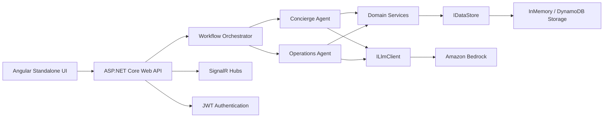

# Hospitality AI Assistant — Solution Structure

This scaffold follows the requirements in [copilot-context.md](copilot-context.md) and keeps the implementation intentionally simple and flat.

## 1. Folder structure

```text
HospitalityAI.sln
solution-structure.md

HospitalityAI.Domain/
  HospitalityAI.Domain.csproj
  Models/
    Guest.cs
    StaffUser.cs
    StaffTask.cs
    ChatMessage.cs
    CheckInRequest.cs
    ForecastRecord.cs
    RecommendationItem.cs
  Interfaces/
    IDataStore.cs
    IGuestService.cs
    IReservationService.cs
    IHousekeepingService.cs
    IMaintenanceService.cs
    IForecastService.cs
    IOtpService.cs
    ILlmClient.cs
    IJwtTokenService.cs

HospitalityAI.Infrastructure/
  HospitalityAI.Infrastructure.csproj
  Storage/
    InMemoryDataStore.cs
  Authentication/
    JwtTokenService.cs
  Llm/
    BedrockLlmClient.cs
  DependencyInjection.cs

HospitalityAI.Agents/
  HospitalityAI.Agents.csproj
  ConciergeAgent.cs
  OperationsAgent.cs
  WorkflowOrchestrator.cs

HospitalityAI.Api/
  HospitalityAI.Api.csproj
  Program.cs
  Controllers/
    AuthController.cs
    ChatController.cs
    ForecastController.cs
  Hubs/
    AgentActivityHub.cs
    DashboardHub.cs
  appsettings.json

HospitalityAI.Tests/
  HospitalityAI.Tests.csproj
  UnitTest1.cs

frontend/
  package.json
  tsconfig.json
  src/
    index.html
    main.ts
    styles.css
    app/
      app.component.ts
      app.config.ts
      app.routes.ts
```

## 2. Project references

- HospitalityAI.Domain: no project references
- HospitalityAI.Infrastructure: references HospitalityAI.Domain
- HospitalityAI.Agents: references HospitalityAI.Domain
- HospitalityAI.Api: references HospitalityAI.Domain, HospitalityAI.Infrastructure, HospitalityAI.Agents
- HospitalityAI.Tests: references HospitalityAI.Api

## 3. Dependency diagram



## 4. Dependency injection plan

- Register domain services in HospitalityAI.Infrastructure via extension methods.
- Register the data store as a singleton or scoped service depending on runtime mode.
- Register the LLM client as a switching implementation so mock mode can be used locally.
- Register agents as transient services.
- Register SignalR hubs and controllers in HospitalityAI.Api through Program.cs.

Suggested registration order:

1. Register configuration values from appsettings.json.
2. Register IDataStore (InMemoryDataStore by default).
3. Register ILlmClient (SwitchingLlmClient or MockLlmClient for local dev).
4. Register JWT services and authentication.
5. Register agents and domain services.
6. Register controllers, hubs, and Swagger.

## 5. Interfaces required in every project

### HospitalityAI.Domain
- IDataStore
- ILlmClient
- IJwtTokenService
- IGuestService
- IReservationService
- IHousekeepingService
- IMaintenanceService
- IForecastService
- IOtpService

### HospitalityAI.Infrastructure
- IStorageProvider (optional extension layer)
- IJwtTokenService implementation
- ILlmClient implementation(s)
- IDataStore implementation(s)

### HospitalityAI.Agents
- IConciergeAgent
- IOperationsAgent
- IWorkflowOrchestrator

### HospitalityAI.Api
- IAuthControllerService (optional thin service)
- IActivityPublisher (optional hub abstraction)

### HospitalityAI.Tests
- Test fixtures for data store and LLM behavior
- Mock implementations of domain interfaces
